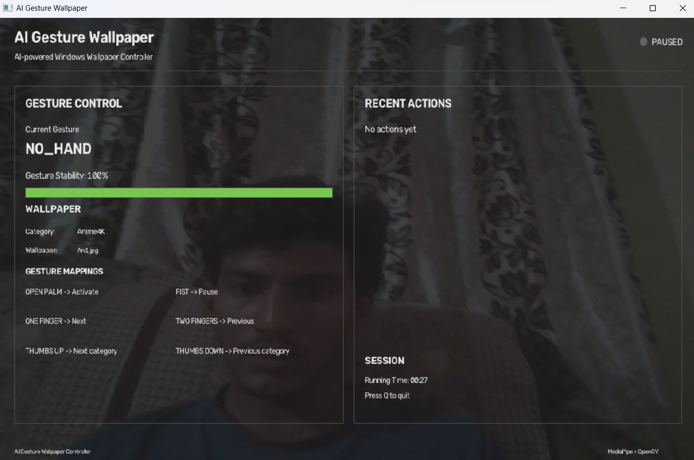

# AI Gesture Wallpaper Controller

An AI-powered Windows desktop application that uses real-time hand gesture recognition to control wallpapers through natural hand movements.

## 📌 Project Overview

AI Gesture Wallpaper Controller combines computer vision and desktop automation to provide a touch-free wallpaper management system.

The application detects hand gestures through a webcam using MediaPipe and OpenCV and maps them to wallpaper actions such as changing wallpapers, switching categories, activating controls, and pausing the system.

## ✨ Features

- Real-time hand gesture recognition
- Touch-free Windows wallpaper control
- Gesture stabilization for reliable detection
- Multiple wallpaper categories
- Next/previous wallpaper navigation
- Next/previous category navigation
- Activate and pause controls
- Professional real-time dashboard
- Gesture stability indicator
- Recent action history
- Hand landmark visualization
- Modular project architecture

## 🖐️ Gesture Controls

| Gesture | Action |
|---|---|
| Open Palm | Activate controls |
| Fist | Pause controls |
| One Finger | Next wallpaper |
| Two Fingers | Previous wallpaper |
| Thumbs Up | Next category |
| Thumbs Down | Previous category |

## 🖥️ Application Preview

The application provides a real-time dashboard displaying the detected gesture, gesture stability, current wallpaper, wallpaper category, system status, and recent actions.




## 🧠 Technologies Used

- Python
- MediaPipe
- OpenCV
- NumPy
- Windows API
- Computer Vision
- Hand Landmark Detection

## 🏗️ Project Structure

```text
AI-Gesture-Wallpaper/
│
├── Wallpapers/
│   ├── Anime4K/
│   ├── Avengers4K/
│   └── Cars4K/
│
├── gestures/
│   └── gesture_detector.py
│
├── models/
│   └── hand_landmarker.task
│
├── ui/
│   ├── __init__.py
│   └── dashboard.py
│
├── src/
│   └── hand_detection_test.py
│
├── main.py
├── gesture_detection.py
├── wallpaper_controller.py
│
├── test_gestures.py
├── test_hand_tracking.py
├── test_wallpaper.py
│
├── requirements.txt
├── README.md
└── .gitignore